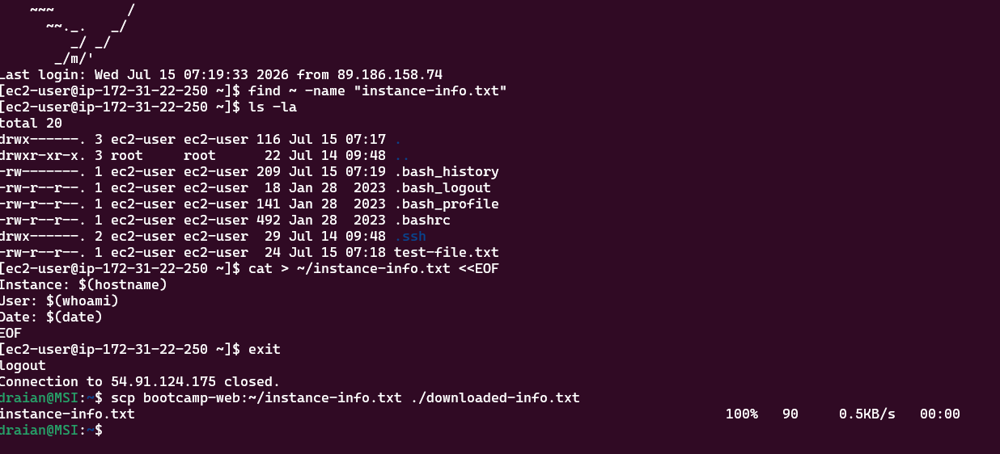

# SSH Connection and Security Best Practices Lab - Solution

**Student Name:** [Dennis]  
**Date Completed:** [14.07]

---

## Instance Details

- **Instance ID:** [i-0f0f2f47563926f55]
- **Public IP:** [54.91.124.175]
- **Security Group:** [week2-web-server-sg]
- **Key Pair:** [bootcamp-week2-key.pem]

---

## Step 1: Create SSH Config File


**My `~/.ssh/config`:**
```
# Week 2 EC2 Instance
Host bootcamp-web
    HostName 54.91.124.175
    User ec2-user
    IdentityFile ~/.ssh/bootcamp-week2-key.pem
    ServerAliveInterval 60
    ServerAliveCountMax 3
    TCPKeepAlive yes
    Compression yes
[Paste your host entry here]
```

- [ x] Connected using the alias: `ssh bootcamp-web`

---

## Step 2: Test Security Group Restrictions


| Test | Expected | Result |
|------|----------|--------|
| `ssh bootcamp-web` | ✅ Connects | [x ] |
| `curl -I http://YOUR_PUBLIC_IP` | ✅ HTTP 200 | [ x] |
| `ping YOUR_PUBLIC_IP` | ❌ Timeout | [x ] |
| `nc -zv YOUR_PUBLIC_IP 3306` | ❌ Blocked | [x ] |

**Why did ping and port 3306 fail?**

yes ping failed

---

## Step 3: Modify Security Group Rules


- [ x] Added HTTPS rule (port 443, source 0.0.0.0/0)
- [x ] Tested it — what happened? [Your answer]
- [x ] Removed the HTTPS rule again

---

## Step 4: Configure SSH Connection Timeouts

**What these settings do:**

- `ServerAliveInterval 60` —Sends a keepalive message to the server every 60 seconds to help keep the SSH connection active.
- `ServerAliveCountMax 3` — Allows 3 unanswered keepalive messages before the SSH client disconnects the session.
- `TCPKeepAlive yes` — Enables TCP keepalive packets to detect broken network connections and maintain the connection.
- `Compression yes` — Enables data compression during the SSH session, which can improve performance on slower network connections.

**Idle for 2 minutes — did the connection stay alive?** [Yes / No]
yes
---

## Step 5: Practice SCP (Secure Copy)



- [ ] Copied a file TO the instance
- [ ] Copied a file FROM the instance
- [ ] Copied a whole directory

**Commands I used:**
```bash
[Paste your scp commands here]
cat > ~/instance-info.txt <<EOF
Instance: $(hostname)
User: $(whoami)
Date: $(date)
EOF
draian@MSI:~$ scp bootcamp-web:~/instance-info.txt ./downloaded-info.txt
```

---

## Step 6: Harden SSH Configuration (On Instance)


**Output of `sudo sshd -T | grep -i "passwordauthentication\|permitrootlogin\|pubkeyauthentication"`:**
```
[Paste output here]
```

| Setting | Expected | Actual |
|---------|----------|--------|
| PasswordAuthentication | no | [ ] |
| PermitRootLogin | without-password | [ ] |
| PubkeyAuthentication | yes | [ ] |

> Only verify these settings — do not modify `sshd_config`.

---

## Step 7: Create Connection Aliases with Scripts

**My `connect-bootcamp.sh`:**
```bash
[Paste your script here]
```

- [ x] Made it executable and tested it

---

## Step 8: Security Group Audit


**Inbound rules:**

| Port | Source | Purpose |
|------|--------|---------|
| [22] | [YOUR_IP/32] | [SSH access] |
| [80] | [0.0.0.0/0] | [Web traffic] |

**Is this configuration secure? What would you improve?**
IssueCurrentRecommendationSSH (22)✅ Restricted to your IP/32Good—keep thisHTTP (80)⚠️ Open to 0.0.0.0/0Fine for web servers, but add HTTPSHTTPS (443)❌ MissingAdd rule: 443 from 0.0.0.0/0Outbound❌ Not shownCheck—should allow HTTPS out (443) for updates

Quick improvements:

Add port 443 inbound from 0.0.0.0/0 (for HTTPS traffic)
Consider adding port 443 and 80 outbound if needed for server updates
Keep SSH restricted to your IP—that's the right call

If web server only: This config is reasonable. Port 80 must be open for web traffic, and SSH restricted to your IP is solid.

[Your answer]

---

## Step 9: Troubleshooting

**Problems I ran into and how I fixed them:**
Claude

[List them here, or write "None encountered"]

---

## Step 10: Security Best Practices

**Which advanced practices did you try or read about (custom SSH port, MFA, session logging)?**

Custom SSH port – Reducing attack surface by moving from port 22 to non-standard port
SSH session logging – Reviewing /var/log/auth.log to track login attempts and who accessed the server
MFA via TOTP – Adding second-factor authentication beyond SSH keys (Google Authenticator)
---

## Bonus Challenges (Optional)

- [ ] **Challenge 1:** Restrict outbound traffic — what broke? [Your answer]
- [ ] **Challenge 2:** Multiple security groups — how do they combine? [Your answer]
- [ ] **Challenge 3:** Connection multiplexing — was it faster? [Your answer]
- [ ] **Challenge 4:** Port forwarding with `ssh -L` — what is it useful for? [Your answer]

---

## Reflection Questions

### 1. Why use an SSH config file instead of typing the full command every time?

[Your answer]

### 2. Why restrict SSH to your IP instead of 0.0.0.0/0?

[Your answer]

### 3. What did the blocked ping and port 3306 tests teach you about security groups?

[Your answer]

### 4. Why disable password authentication for SSH?

[Your answer]

---

## Key Learnings

**What was most challenging about this lab?**

[Your reflection]

**What security practice will you always follow from now on?**

[Your reflection]

---

## Checklist

- [ ] SSH config file working with alias
- [ ] Security group tests done and documented
- [ ] Security group rule added and removed
- [ ] SCP tested both directions
- [ ] SSH daemon settings verified
- [ ] Connection script created
- [ ] Security group audited
- [ ] All screenshots captured
- [ ] Reflection questions answered
- [ ] Work committed to Git
- [ ] Pull request created

---

**Completed By:** [Your Name]  
**Date:** [Date]
